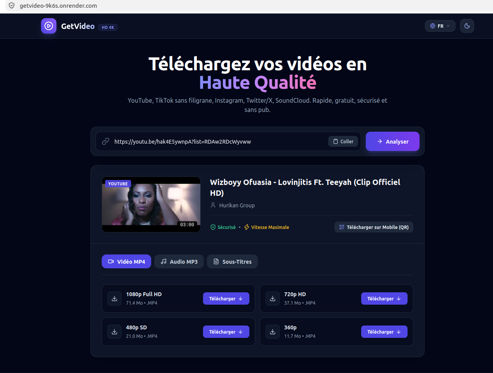
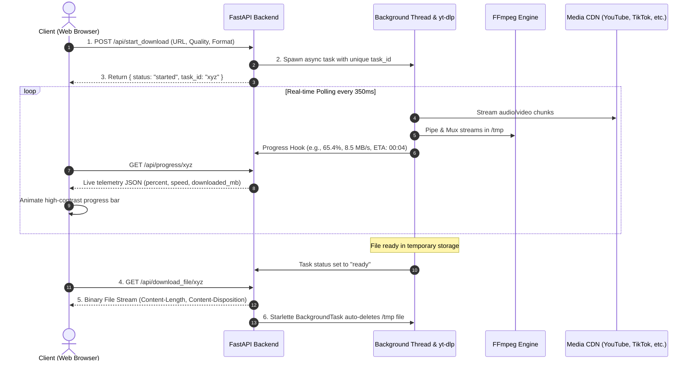

# ⚡ GetVideo - High-Performance Universal Media Extraction & Streaming Engine

<div align="center">

[](https://fastapi.tiangolo.com)
[](https://www.python.org/)
[](https://www.docker.com/)
[](https://tailwindcss.com/)
[](https://opensource.org/licenses/MIT)
[](https://getvideo-9k6s.onrender.com)

**A modern, production-grade, zero-storage media extraction and processing platform.**  
Seamlessly download high-definition video (up to 4K) and studio-grade audio (320 kbps) from **YouTube, TikTok (No Watermark), Instagram, Twitter/X, SoundCloud**, and 1000+ sources with real-time progress synchronization.

[🚀 Explore Live Demo](https://getvideo-9k6s.onrender.com) • [📊 View Live Analytics](https://getvideo-9k6s.onrender.com/admin.html) • [📖 API Documentation](https://getvideo-9k6s.onrender.com/docs)

---

</div>

## 📸 Interface Preview

<div align="center">
  
  <p><i>Modern Dark UI with Real-time Progress Tracking, Responsive QR Code, and Multi-language Support</i></p>
</div>

---

## 🌟 Key Features

- **🎯 Universal Media Support**: Extract media from YouTube, TikTok, Instagram, Twitter/X, Facebook, SoundCloud, Twitch, Vimeo, and more.
- **⚡ Real-Time Progress Synchronization**: Async background task processing with sub-second polling (350ms) reporting exact download percentage (0% $\rightarrow$ 100%), network speed, and ETA.
- **🛡️ Zero-Storage Policy**: Ephemeral temporary storage with Starlette `BackgroundTask` automated zero-leak deletion immediately upon file delivery.
- **🎵 Studio Audio & HD Video Muxing**: Automatic stream demuxing and remuxing with `FFmpeg` to produce merged 1080p/4K MP4 and clean 320 kbps MP3 files.
- **🌐 Dynamic Multi-Language Engine (i18n)**: 6 fully supported languages with instant client-side switching and RTL support (English 🇬🇧, French 🇫🇷, Spanish 🇪🇸, Arabic 🇸🇦, German 🇩🇪, Portuguese 🇵🇹).
- **📊 Embedded Real-Time Analytics Dashboard**: Built-in SQLite-backed KPI tracker monitoring total requests, successful downloads, transferred bandwidth, and top platforms (`/admin.html`).
- **📱 Responsive Mobile Experience & PWA**: Mobile-first design with dynamic QR-Code generation for instant smartphone downloading and PWA installability.
- **🔒 Enterprise Security**: Sliding-window IP Rate Limiting (15 req/min), Anti-SSRF private subnet blocker, bad bot user-agent filtering, and strict HTTP security headers.

---

## 🏗️ Architecture & Pipeline

GetVideo is engineered with an asynchronous event-driven pipeline designed for low memory consumption (< 60 MB RAM) and high concurrency:



---

## 🛠️ Tech Stack

- **Backend**: Python 3.11, [FastAPI](https://fastapi.tiangolo.com/), [Uvicorn](https://www.uvicorn.org/), [yt-dlp](https://github.com/yt-dlp/yt-dlp), [HTTPX](https://www.python-httpx.org/), Starlette
- **Multimedia Engine**: [FFmpeg](https://ffmpeg.org/) (Multi-stream audio/video merger & transcoder)
- **Frontend**: Vanilla JavaScript (ES6+), [Tailwind CSS](https://tailwindcss.com/), [Lucide Icons](https://lucide.dev/)
- **Database / Metrics**: Embedded SQLite with persistent telemetry logging
- **Containerization**: Docker (Multi-stage lightweight Debian Slim image)
- **Deployment**: Render / Koyeb / Oracle Cloud Infrastructure / Self-Hosted VPS

---

## 💻 Local Installation & Setup

Follow these simple steps to run GetVideo locally on your computer.

### Prerequisites

Make sure you have the following installed on your machine:
- **Python 3.10+** (Python 3.11 recommended)
- **Git**
- **FFmpeg** (Required for audio/video merging)

#### Installing FFmpeg:
- **Ubuntu / Debian Linux**:
  ```bash
  sudo apt update && sudo apt install -y ffmpeg
  ```
- **macOS (Homebrew)**:
  ```bash
  brew install ffmpeg
  ```
- **Windows (Chocolatey / Scoop)**:
  ```powershell
  choco install ffmpeg
  ```

---

### Step 1: Clone the Repository

```bash
git clone https://github.com/sylvanodjatche/getvideo.git
cd getvideo
```

### Step 2: Set Up Virtual Environment

```bash
# Create virtual environment
python3 -m venv venv

# Activate virtual environment
# On Linux / macOS:
source venv/bin/activate

# On Windows (PowerShell):
.\venv\Scripts\Activate.ps1
```

### Step 3: Install Dependencies

```bash
pip install --upgrade pip
pip install -r backend/requirements.txt
```

### Step 4: Run the Application

```bash
# Quick start using the automated launch script:
chmod +x run.sh
./run.sh

# Or start directly with Uvicorn:
uvicorn backend.app.main:app --host 0.0.0.0 --port 8000 --reload
```

Open your browser and navigate to:
- 🌐 **Web Interface:** `http://localhost:8000`
- 📊 **Analytics Dashboard:** `http://localhost:8000/admin.html`
- 📖 **Interactive Swagger API Docs:** `http://localhost:8000/docs`

---

## 🐳 Docker Deployment

To run GetVideo inside an isolated Docker container:

```bash
# 1. Build the Docker image
docker build -t getvideo:latest .

# 2. Run the container
docker run -d -p 8000:8000 --name getvideo-app --restart always getvideo:latest
```

Your service is now available at `http://localhost:8000`.

---

## 🔌 API Endpoints Reference

| Method | Endpoint | Description |
| :--- | :--- | :--- |
| `GET` | `/api/info?url={url}` | Extracts metadata, thumbnail, duration, and available HD formats. |
| `POST` | `/api/start_download` | Initializes background download task and returns a unique `task_id`. |
| `GET` | `/api/progress/{task_id}` | Returns real-time telemetry (progress %, speed, ETA, size). |
| `POST` | `/api/cancel_download/{task_id}` | Aborts an ongoing task and purges temporary files. |
| `GET` | `/api/download_file/{task_id}` | Streams the completed file and triggers automated cleanup. |
| `GET` | `/api/subtitle?url={url}` | Fetches subtitle streams in `.vtt` / `.srt` format. |
| `GET` | `/api/admin/stats` | Delivers real-time analytics data for the dashboard. |
| `GET` | `/api/health` | Healthcheck probe endpoint for container orchestrators. |

---

## 📈 Live Analytics & KPIs

GetVideo includes an integrated, zero-overhead analytics dashboard accessible at `/admin.html`. It tracks:
1. **Total Extractions**: Quantifies user interactions and analyzed media links.
2. **Delivered Downloads**: Records completed file streams without storing user PII.
3. **Transferred Bandwidth (GB)**: Measures network throughput and server efficiency.
4. **Platform Popularity Distribution**: Categorizes traffic sources (YouTube, TikTok, Instagram, Twitter/X).
5. **Format Preferences**: Compares Video MP4 vs Audio MP3 download ratios.

---

## 📄 License

This project is open-source and distributed under the **MIT License**. See the [LICENSE](LICENSE) file for more information.

---

## 👨‍💻 Author

**Sylvano Djatche**  
*Software Engineer & Full-Stack Developer*  
- **GitHub:** [@sylvanodjatche](https://github.com/sylvanodjatche)
- **Project Repository:** [github.com/sylvanodjatche/getvideo](https://github.com/sylvanodjatche/getvideo)
